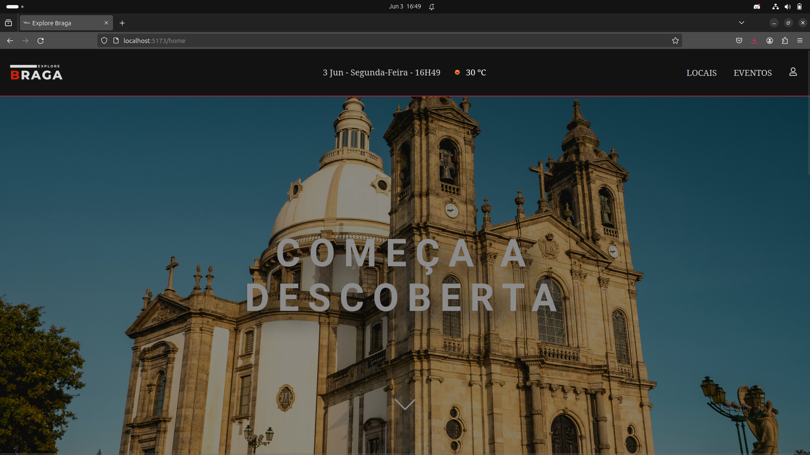
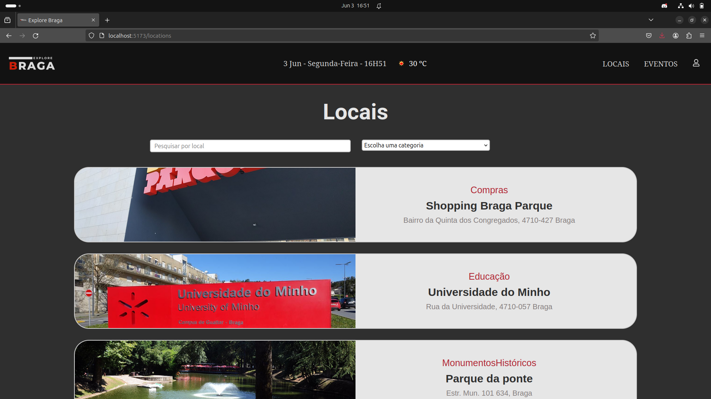
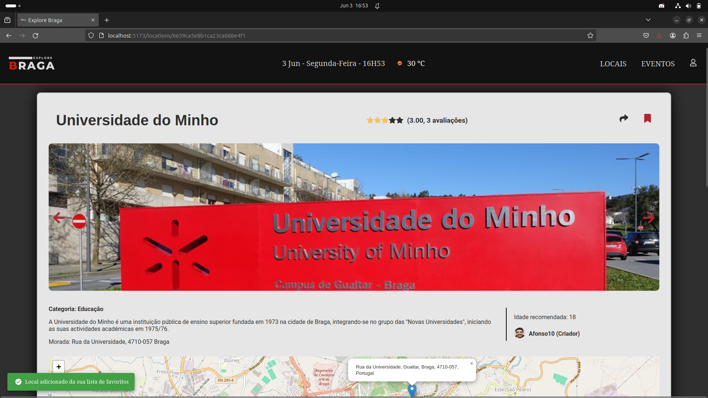
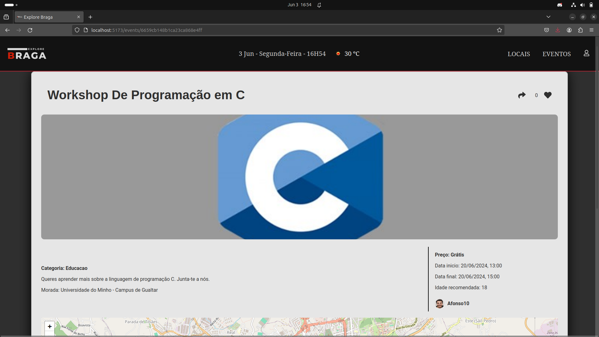
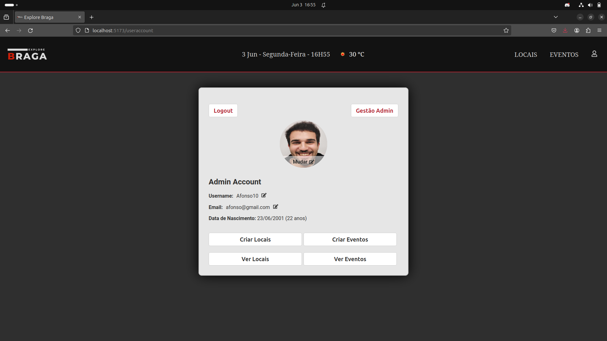
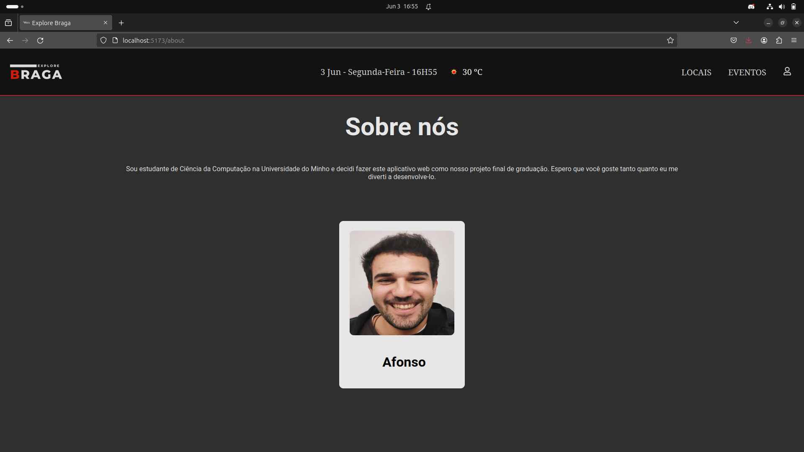

# Projeto ExploreBraga

Projeto final da minha licenciatura, que consiste em uma página web de divulgação de eventos/locais de uma cidade (neste caso, de Braga). Foi desenvolvido utilizando a pilha MERN (MongoDB, Express.js, React.js, Node.js). Para mais detalhes, consulte o relatório do projeto "UC_PROJETO.pdf".

## Instruções para Executar o Projeto

### Pré-requisitos

- Node.js instalado
- MongoDB instalado e rodando

### Configuração

1. Clone o repositório:

    ```bash
    git clone <URL_do_repositório>
    cd <nome_do_repositório>
    ```

2. Configure as variáveis de ambiente:

    Crie um arquivo `.env` na pasta `backend` com as seguintes variáveis:

    ```env
    mongoDBURL=<sua_url_do_mongodb>
    MySecret=<sua_chave_secreta>
    ```

    - **mongoDBURL**: URL do seu banco de dados MongoDB.
    - **MySecret**: Palavra chave segura para a encriptação dos JWT para o login.

3. Verifique a rota do frontend:

    Se a sua aplicação frontend estiver rodando em uma rota diferente de `http://localhost:5173`, você precisará atualizar a configuração de origem no arquivo `./backend/index.js`.

### Comandos

#### Na Pasta Raiz:

- Instalar dependências e limpar pastas `node_modules` do frontend e backend:

    ```bash
    npm run clean-install
    ```

- Iniciar a aplicação (frontend/backend simultaneamente):

    ```bash
    npm start
    ```

#### Na Pasta `frontend` ou `backend`:

- Iniciar o servidor separadamente:

    ```bash
    npm run dev
    ```

## Estrutura do Projeto

- **Frontend (React)**: O React é responsável pela interface do usuário, renderizando componentes e interagindo com a API do backend para exibir e atualizar dados.

- **Backend (Node.js e Express.js)**: Express.js, rodando no Node.js, trata as requisições do frontend. Ele define as rotas da API, processa os dados e interage com o banco de dados MongoDB.

- **Base de Dados (MongoDB)**: MongoDB armazena os dados da aplicação e responde a consultas e operações de CRUD feitas pelo backend.

## Considerações Finais

Esteja livre para explorar o meu site, mas lembre-se de configurar corretamente as variáveis de ambiente conforme explicado acima. Agradeço pelo interesse e espero que este projeto seja útil e inspirador para outros desenvolvedores.

## Algumas Fotos do site:

### Pagina Home

 

### Pagina locais




### Pagina eventos



### Pagina User



### Pagina Sobre nós


